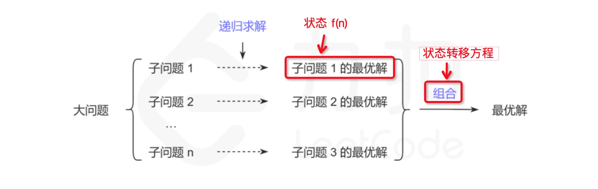
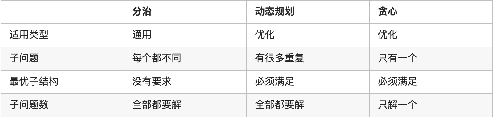

# 算法初级中涉及的数据结构和算法总结
[TOC]

## 线性结构

### 数组
使用**顺序存储**方式实现

* 读取：时间复杂度为o(1)
* 查找：时间复杂度为o(n) 
	* 从索引为0开始查找元素，找到就停止查找。 
    
* 插入：时间复杂度为o(n)
	* 中间插入时，需要从想要插入的位置开始向后移动，空出位置插入新值。
		* 插入第一个元素时，需要移动n次。
	* 末尾插入时，只需要计算添加的内存地址即可	 	
* 删除：时间复杂度为o(n)
	* 当删除一个元素后，后面的元素要向前移动填补空位

> **数组频繁的插入会造成时间上的浪费，最好使用链表。**

### 链表
使用 **链式存储**方式实现

* 读取：时间复杂度为o(n)
	* 想要访问某个元素，必须要从头节点开始遍历，通过next属性找到下一个节点，直到找到为止。n为链表长度，最多需要遍历n次。
* 查找：时间复杂度为o(n)
* 插入：时间复杂度为o(1)
* 删除：时间复杂度为o(1)

> **总结：**
> 链表结构更适合需要频繁插入和删除操作的数据处理。

### 栈和队列
栈是先进后出（LIFO）
队列是先进先出（FIFO)

#### 优先队列
> 待补充

#### 与数组和链表的区别
* **栈和队列可以用数组或链表实现。**
* 数组 和 链表 主要描述了数据是如何存储的，和存取方式无关。
* 而栈和队列是对数据的存取方式作了特殊的规定，是一种更抽象的数据结构

## 树
是一种具有树状结构的集合

### 二叉树
树中的结点最多只能有两个子树的树状结构。通常称为左子树和右子树。

* 二叉树可以使用链式的方式存储。每个结点对象中都有left和right两个指针指向左右子结点。
* 二叉树也可以用数组的方式存储。在堆排序中，就是将数组想象成一个堆结构。
* 二叉树相关的算法题中（简单）可以使用 
	* BFS算法
		* 使用 迭代 + 队列方式实现。具体的代码中使用while循环实现迭代，在while循环体中 先取出数组头部元素，进行逻辑运算，根据条件判断决定是否向数组尾部增加元素，以此实现了队列的先进先出特性。
		* 时间复杂度通常为 o(n), 因为可能要遍历树中的所有结点
		* 空间复杂度通常为 o(n), 队列占用的空间大小和树中的结点数量有关。
	* DFS算法
		* 使用 递归 + 栈 方式实现。

#### 完全二叉树
除了最后一层的右边，其他节点都已填满

#### 堆
满足以下两个条件的二叉树就是堆
* 完全二叉树
* 每个节点的值总是大于等于其子节点的值（最大堆）； 或者小于等于其子节点的值（最小堆）

##### 堆的操作
* 读取最大或最小值：
	* 时间复杂度为 O(1)
* 插入元素
	* 时间复杂度为 O(logN) 
* 删除元素 
	* 时间复杂度为 O(logN) 

## 散列表（哈希表）

哈希表具有唯一特性

哈希集合
	Set
	
哈希映射
	Map

-----

# 算法

## 动态规划
> [动态规划精讲（一）](https://leetcode-cn.com/leetbook/detail/dynamic-programming-1-plus/)

### 什么是动态规划？
* 不是具体的算法，而是一种算法思想
	* 若要解一个给定问题，需要解它的子问题，再组合子问题的解得出原问题的解
	* 通过把原问题分解为相对简单的子问题的方式求解复杂问题的方法。
* 动态规划（英语：Dynamic programming，简称 DP）

### 什么样的问题适合使用动态规划？
动态规划要解决的都是一些问题的**最优解**，即从很多解决问题的方案中找到最优的一个

**具有最优子结构和重复子问题的问题**

#### 什么是最优子结构？
* 首先原问题可以被分解成多个子问题。
* 并且可以递归找到每个子问题的**最优解**
* 最后可以**组合**每个子问题的最优解，从而得到原问题的最优解

* 通常使用**f(n)**表示问题的最优解，而f(n)代表**状态**。
*  **状态转移方程** 是根据状态f(n) 得到子问题最优解的过程 （不是组合子问题最优解的过程）

**举例说明**
斐波那契数列
> 待补充

#### 重复子问题是什么？
在递归寻找每个子问题的最优解的时候，可能会重复地遇到一些更小的子问题，而且这些子问题会重叠地出现在子问题里，出现这样的情况，会有很多重复的计算， _动态规划可以保证每个重叠的子问题只会被求解一次_ （使用的就是递归中的Memorization方式解决的）

_重复子问题不是保证解的正确性必须的_(这句话该怎么理解呢？即便没有重复子问题是属于动态规划范围，只不过和普通递归的效率相同)

### 解决动态规划问题思路

1. 首先分析如何拆分为子问题
2. 如何得到子问题的最优解 （确定状态）
3. 如何组合子问题的最优解（确定状态转移方程）

#### 拆分为子问题，数组上常用的两种方式
* 每次减少一半 （二分）
* 每次减少一个
	* 记f(n) 为以第 n 个数结尾的最长子序列，每次减少一个，将原问题分为 f(n−1),f(n−2), ..., f(1)，共 n−1 个子问题

> 重点是拆分之后是否可以将子问题的最优解组合得到原问题的最优解。 如果找不到组合方式，则不能采用这种拆分方式

### 动态规划与其他算法的关系

#### 分治
分治算法思想含有最优子结构，但是不存在重复子问题。
动态规划 含有 最优子结构和重复子问题

#### 贪心
> 对贪心不了解，先记录一下

1. 关于最优子结构
贪心：每一步的最优解一定包含上一步的最优解，上一步之前的最优解无需记录
动态规划：全局最优解中一定包含某个局部最优解，但不一定包含上一步的局部最优解，因此需要记录之前的所有的局部最优解

2. 关于子问题最优解组合成原问题最优解的组合方式
贪心：如果把所有的子问题看成一棵树的话，贪心从根出发，每次向下遍历最优子树即可，这里的最优是贪心意义上的最优。此时不需要知道一个节点的所有子树情况，于是构不成一棵完整的树
动态规划：动态规划需要对每一个子树求最优解，直至下面的每一个叶子的值，最后得到一棵完整的树，在所有子树都得到最优解后，将他们组合成答案

3. 结果正确性
贪心不能保证求得的最后解是最佳的，复杂度低
动态规划本质是穷举法，可以保证结果是最佳的，复杂度高

-----

DFS

BFS

分治思想

二分法

贪心算法

查找表

# 技巧

双指针

快慢指针

# 其他

## 递归

### 递归代码实现思路
> [三道题套路解决递归问题](https://lyl0724.github.io/2020/01/25/1/#递归解题三部曲)

解递归题的三部曲：
1.	找整个递归的终止条件：递归应该在什么时候结束？
2.	找返回值：应该给上一级返回什么信息？
3.	本级递归应该做什么：在这一级递归中，应该完成什么任务？

### 时间复杂度的计算
* 递归调用的数量 乘以 每层递归函数中的时间复杂度。

#### 如何分析递归调用的数量？
使用**执行树**分析。
> 执行树是用于表示递归函数的执行流程的树。树中的每个节点都表示递归函数的调用。因此树中的节点总数对应于执行期间的递归调用的数量

**举例：**
* 斐波那契数列 在暴力解法中, 斐波那契数列函数的执行将形成**二叉树**
* 在n层的完全二叉树中，节点的总数为2^n -1。那么时间复杂度的上限就是O(2^n)

**举例：**
* 归并排序递归解法的时间复杂度就是: O（NlogN)
	* 递归调用的数量为 logN
	* 每层递归函数的时间复杂度为 O(N) 

* 可以使用Memorization（记忆化）技术 来降低时间复杂度
**举例：**
* 斐波那契数列可以使用一个全局的Map类型对象用于记录重复计算的结果。这样时间复杂度可以降低至O(N)

### 空间复杂度的计算
需要考虑以下两点：
1. 由递归直接引起的内存开销，就是用于跟踪递归函数调用的**堆栈**。
	系统会在栈中分配一些空间来保存三个重要信息
	* 函数调用的返回地址
	* 传递给函数调用的参数
	* 函数调用中的局部变量
2. 非递归相关空间
	不是在递归函数内部分配的空间。
	通常包括为全局变量分配的空间
	比如在Memorization（记忆化）	技术中，设定全局变量用于保存递归调用的中间结果。

> 总结：
> 递归导致的堆栈内存开销，需要分析一共调用了多少层的递归函数，层数即为空间复杂度
> 非递归相关空间通常是常数级别，所以一般情况下空间平均复杂度都是由堆栈内存开销决定的。
> 有堆栈溢出风险

### 尾递归

## 迭代

> 总结：
> 递归是自顶向下， 迭代是自底向上
> 

